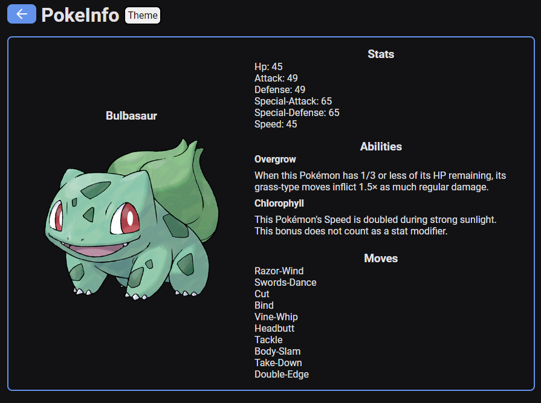

# Pokédex API

The Pokédex API is a web application that allows users to browse a list of 1124 Pokémon, with the ability to view 10 Pokémon per page. Each Pokémon in the list is displayed with their name and image.

When a user clicks on a Pokémon from the list, they will be redirected to a page with more detailed information about the Pokémon, including its official art, type, abilities, and moves.

